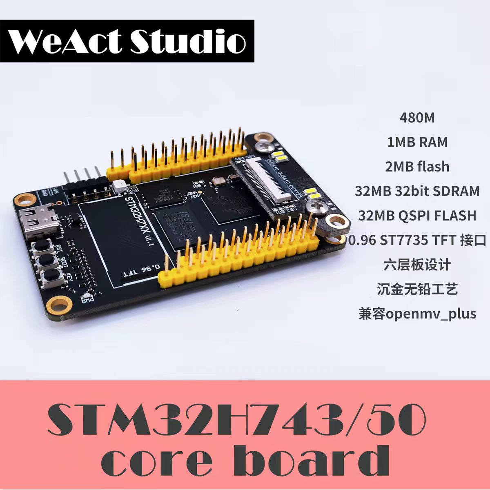
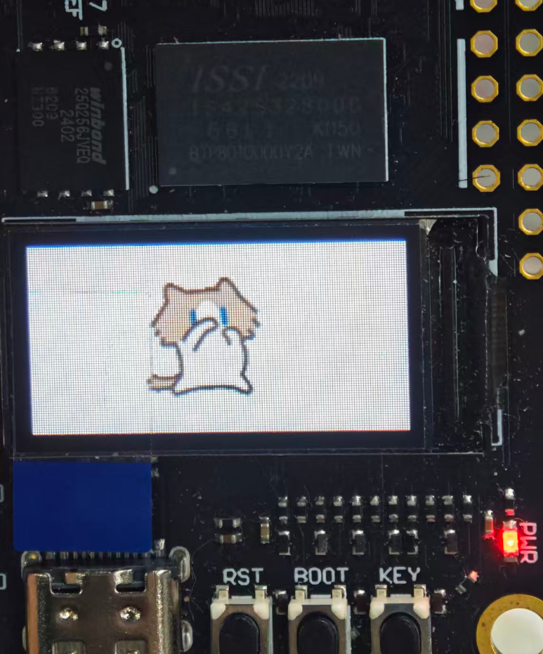

# H7REC

STM32H743 工程，基于 FreeRTOS，实现 USB CDC 文件传输到 SD 卡，并在 ST7735 LCD 上显示运行状态。  

  
# 使用 keil ac6 编译

## Lib
- [FreeRTOS](https://github.com/FreeRTOS/FreeRTOS-Kernel/releases/tag/V10.3.1-kernel-only)
- [CherryUSB@v1.6.1](https://github.com/cherry-embedded/CherryUSB)
- [STM32H743iikx](https://www.st.com/en/microcontrollers-microprocessors/stm32h743ii.html)
- [ST7735](https://www.bing.com/search?q=ST7735)
- [SEGGER-RTT@v7.98a](https://www.segger.com/products/debug-probes/j-link/technology/about-real-time-transfer/)
- [LVGL@8.4.0](https://github.com/lvgl/lvgl)
- [rlottie@V0.2](https://github.com/Samsung/rlottie)

- 由于cubemx生成的FreeRTOS使用的 ac5 工具链的 portable 故而重新生成cubemx代码之后需要重新替换 ac6 所需的 portable
- External\FreeRTOS-Kernel-10.3.1-kernel-only\portable\GCC\ARM_CM4F 覆盖 Middlewares\Third_Party\FreeRTOS\Source\portable\RVDS\ARM_CM4F

## 主要功能

- FreeRTOS 多任务运行
- CherryUSB CDC 虚拟串口通信
- PC 端脚本发送文件到 STM32
- STM32 接收文件并保存到 SD 卡 `0:/rx`
- 文件传输支持分块 ACK、块 CRC、整文件 CRC 校验
- ST7735 LCD 显示时间、SD 状态和文件接收进度
- LVGL 8.4.0 移植与基础显示测试
- SEGGER RTT 输出调试信息

## 目录说明

```text
App/
  FileTransfer/   USB CDC 文件接收与 SD 写入逻辑
  Gui/            LVGL UI 任务、移植接口和配置
  Storage/        SD 卡初始化、挂载和容量查询
BSP/
  CherryUSB_port/ CherryUSB 移植代码
  ST7735/         LCD 驱动与显示测试
Core/             CubeMX 生成的主工程代码和 FreeRTOS 任务
External/         CherryUSB、SEGGER RTT、LVGL 等第三方库
FATFS/            CubeMX 生成的 FatFs 应用层配置
Middlewares/      FreeRTOS、FatFs 等第三方中间件
tools/pc/         PC 端文件发送脚本
doc/              项目记录和问题排查文档
```

## LVGL 移植测试

工程已集成 `External/lvgl-8.4.0`，并在 `App/Gui/LvglPort` 中放置 LVGL 显示、输入和文件系统移植接口。当前已完成 Keil 工程编译集成和 ST7735 屏幕基础显示测试。



## 文件发送

安装 PC 端依赖：

```bash
pip install pyserial
```

发送文件：

```bash
python tools/pc/send_file.py COM7 H7REC.HEX
```

更多脚本参数见：

- [tools/pc/README.md](tools/pc/README.md)

## 相关文档

- [STM32H743 移植 CherryUSB 与 SEGGER RTT 的问题排查记录](doc/cherryusb_rtt_qa_zh.md)
- [CDC 文件传输到 SD 卡记录](doc/cdc_file_transfer_to_sd_zh.md)
